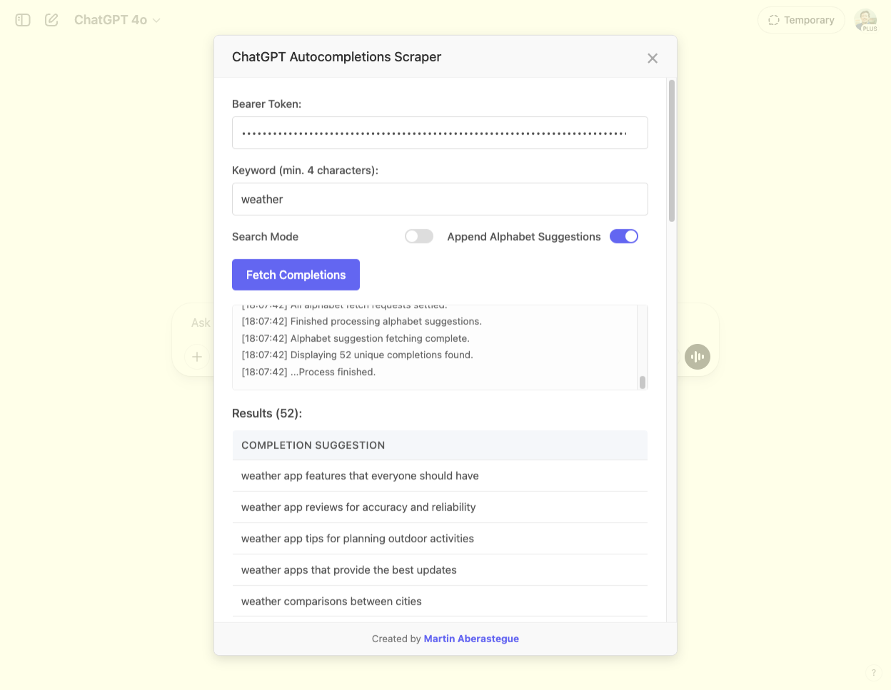

# ChatGPT Autocompletions Scraper

This tool allows you to extract autocompletion suggestions from ChatGPT for any keyword or phrase you want to research.

## How it works

This tool creates a modal interface in ChatGPT that lets you:

1. Query autocompletion suggestions for a keyword
2. Recursively search through multiple levels of suggestions
3. Generate suggestions for each letter of the alphabet combined with your keyword

**Important note**: All processing happens within the same page and no data is sent outside of ChatGPT and its services. This tool only interacts with ChatGPT's own API endpoints.

## How to use the tool

1. Open [ChatGPT](https://chatgpt.com/) in your browser and make sure you're logged in
2. Open your browser's developer tools (F12 or right-click > Inspect)
3. Go to the "Console" tab
4. Copy all the content from the `gpt_autocompletions.js` file
5. Paste the code into the console and press Enter

A modal will open with the following options:

### Main parameters

- **Bearer Token**: Paste your ChatGPT session token (see below how to obtain it)
- **Keyword**: Word or phrase to search for (minimum 4 characters)
- **Search Mode**: Enable or disable recursive search mode

### Secondary options

- In normal mode (Search Mode disabled):
  - **Append Alphabet Suggestions**: Adds each letter of the alphabet to your keyword and searches for suggestions

- In search mode (Search Mode enabled):
  - **Depth**: Depth level for recursive search (0-5)

## How to get your Bearer Token

1. In ChatGPT, open the developer tools (F12)
2. Go to the "Application" tab
3. In the left panel, expand "Cookies"
4. Select "https://chatgpt.com"
5. Find the cookie named `__Secure-next-auth.session-token`
6. Copy the value of this cookie and paste it in the "Bearer Token" field of the modal

## Interpreting results

Results will be displayed in a table with all unique autocompletion suggestions found. The log area in the modal also shows progress and any errors that may occur.

## Limitations

- Requires being logged into ChatGPT
- Session token needs to be provided (which is private and should not be shared)
- Requests are subject to ChatGPT API limitations

## Credits

Created by [Martin Aberastegue](https://www.martinaberastegue.com) 
